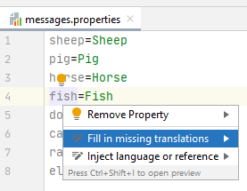
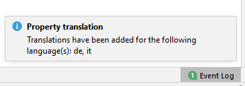

# Properties translation

<!-- Plugin description -->
Plugin for intellij IDEA that adds automated translation functionality to properties files.

<!-- Plugin description end -->
More specifically, it adds an intent action when hovering over the key of a property in a properties file. When clicked, this action detects which languages are missing translations for that property and then adds missing translations using google translate. 

## Usage

1. Select the property to be translated and open the _intention actions menu_ (Alt+Enter)
2. Click on the _Fill in missing translations_ intent

    

3. After the translations have been added, a notification is shown that displays for which languages a translation has been added

    

## Limitations

* The plugin is unable to infer the locale of the default properties file. As a consequence, it will never add translations to this file.

## Possible improvements

* Add support for multiple translation APIs
* Use language detection to infer locale of default properties file
* Allow multiple properties to be translated at once
